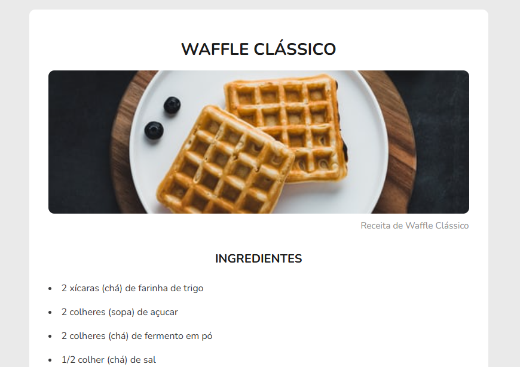

<h1 align="center">
  💻 Receita Waffle Clássico
</h1>

  

<h4 align="center"><a href="https://receita-waffle-classico.vercel.app/" target="_blank">Clique para visitar o projeto</a></h4>

## 📚 Sobre o projeto

Este projeto é sobre a receita de um Waffle Clássico, onde mostra os ingredientes e modo de preparo da receita. O projeto faz parte dos Desafios do Discover da Rockeseat, onde os objetivos eram dois:

1. Criar a estrutura da página com HTML.
2. Estilizar a página usando CSS.

💡<b>Observação</b>: Além do que foi pedido no desafio, eu também acrescentei responsividade, para que a página fique adaptável em outros tamanhos de dispositivos. 🚀

## 🛠️ Tecnologias utilizadas

• HTML 
• CSS 
